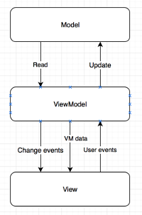

# Kotlin Start Project #
[]()
[]()
### What is this repository for? ###

* Mood Up Labs' bootstrap for Android applications written in Kotlin - reduces boilerplate!
* 1.0.0

### How do I get set up? ###

1. Clone this repo.
2. Open the project in Android Studio (`File -> Open` select main directory).
3. Sync project with Gradle
4. Enjoy!

### Customization? ###

1. Select the root package and rename to your own package name (`Refactor -> Rename...`).
2. Test project contains code usage examples, the example code is marked with TODO comments, remove or refactor all marked places. 

### Contribution guidelines ###

* Please use PRs! If you want to have a discussion about some new/existing feature please file an issue (**first check if maybe issue already exists**)

### Who do I talk to? ###

* Anyone from the Mood Up Labs's Android Team :) 
* bs.smektala@mooduplabs.com, patryk@mooduplabs.com

### Features ###

* Base application - API client, the data module
* BaseActivity, BaseFragment, ViewModel, ViewHolder - handles injections and view binding

# Project documentation #

# Project name #
[]()

(Add short project description here)

## Installation ##

Just clone this repository, and import the project in Android Studio and sync with Gradle.

## Building ##

Application implements Flavors and FlavorDimensions.


In order to build **staging debug** version invoke

```
./gradlew assembleStagingDebug
```

In order to build **production debug** version invoke

```
./gradlew assembleProductionDebug
```
## Architecture ##
The project is created in MVVM architecture, which allows separating the user interface logic from the business logic.

MVVM has mainly the following layers:
- Model
    Model represents the data and/or information.
- ViewModel
    ViewModel interacts with model and also prepares observable(s) that can be observed by a View.
- View
    View is to subscribe to a ViewModel to get data in order to update UI elements accordingly.

MVVM components and interaction between them:




## Dependencies ##
Dependencies used in the application:

1. [Koin](https://github.com/InsertKoinIO/koin/) - service locator framework
2. [Gson](https://github.com/google/gson) - convert a JSON string to an equivalent Kotlin object
3. [Retrofit2](http://square.github.io/retrofit/) - HTTP client
4. [Mockito](http://mockito.org) - mocking framework for unit tests
5. [RxAndroid](https://github.com/ReactiveX/RxAndroid) - Android specific bindings for RxJava

## Tests ##
All test in the app can be run without an Android device or emulator. The project contains JUnit tests and using Robolectric (http://robolectric.org) If JVM is necessary. The data is mocked by Mockito (https://github.com/mockito/mockito) and the API responses by MockWebServer (https://github.com/square/okhttp/tree/master/mockwebserver)

##### Running tests #####

The test can be run on Android studio or command like:

```
./gradlew clean test
```
Before you run any tests we suggest you clean the project (otherwise it may throw an exception)

